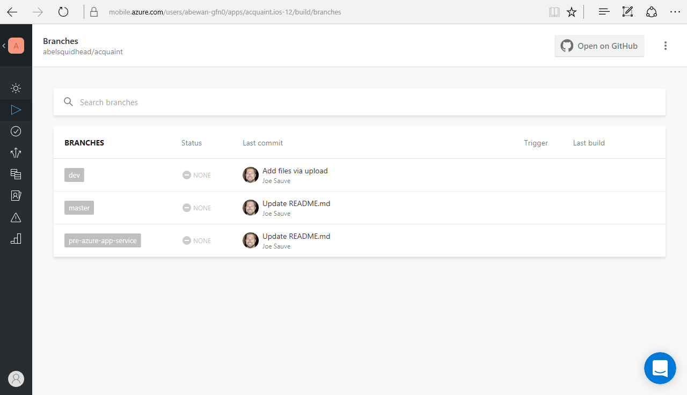

# Mobile DevOps with the Microsoft stack (Demo Script)

## Demo Overview

### High-level flow

DevOps is the union of People, Process and our Products to enable continuous
delivery of value to your end users.  No where is this more important than in the
world of mobile development.  However, mobile presents its own unique set of
challenges. 

1.  Building mobile apps for the different platforms is extremely painful to set up and
    requires special hardware.  iOS code must use macs to build.  Android must have the 
    right software installed and configured on the build machines.

2.  There are thousands of mobile devices.  How will you test your app across all those
    devices?

3.  Deploying apps to alpha testers, beta testers etc.  even all the way to the store is
    difficult and cumbersome.

4.  Need to collect crash analytics from devices

5.  Need to collect telemetry from devices

Visual Studio Mobile Center addresses all of these issues and with a couple of clicks, you can
build out your entire DevOps pipeline.  Continuous Integration, Continuous Testing, Continous Delivery,
Continuous Learning.  You also have an integrated set of dashboards with everything you need for
your mobile app in one easy to consume place

### Key Takeaways

1.  Microsoft has products and services that give you that full mobile DevOps coverage.  VSTS
    for build and release orchestrations.  Xamarin Test Cloud for automated UI testing on over 
    2000 physical devices.  Hockey App for deployment to alpha/beta testers, crash analytics and 
    user telemetry.

2.  This is spread across 3 services requiring the user to go to three seperate product pages to see
    what's going on with one mobile app.  Wouldn't it be great to have a single place to see all of this? Actually, we do have this.  Visual Studio Mobile Center.  Visual Studio Mobile Center is a mobile centric lens on top of Visual Studio Team Services.  Visual Studio Mobile Center is your mission control center for your mobile app.

2.  Visual Studio Mobile Center simplifies the enter DevOps pipeline for mobile 
    apps. With a couple of clicks, you can set up Continuous Integration,
    Continuous Delivery, Continuous Testing, Continuous Learning

2.  Visual Studio Mobile Center works for all mobile languages and platforms.
    iOS using swift, objective c, react native.  Android using java or react native.
    Xamarin using c#.  

3.  Visual Studio Mobile Center is your mission control center for mobile apps.  It
    is your one stop shop where you can see everything related to your mobile app
    in one consolidated place with easy to read dashboards.

## Demo Setup
For this demo, you need access to the cadddemos instance of VSTS.  Specifically, the XTC-BikeRiding-iOS build and the Auto-depoy to HockeyApp release.

You will also need access to Xamarin Test Cloud and Hockey App

VS Mobile Center with access to the BikeRider - Prod
for iOS app as one of your apps in Mobile Center is required as well.  I contacted Simina on the Mobile Center team and
she gave me access to the project.

Finally, you will need to clone the acquaint mobile xamarin app into your GitHub account

1.  Browse to your github account and click New repository

    

2.  Enter MyAcquaint for Repository name
    
    Enter Mobile xamarin app Description
    
    Click Create repository

    

3.  Click Import code

    

4.  Enter **https://github.com/abelsquidhead/acquaint.git** into Your old repository's clone URL and then click Begin import

    

5. Wait for import to finish

    

## Demo 

1.  Start up slide deck

      

    >**Talking Point**: Good morning everyone.  Today's session is on Mobile DevOps with the Microsoft Stack.  We are going to dive in and see how the tools and services from Microsoft help enable you to creating that end to end DevOps experience for mobile apps.

2.  Next slide

      

     >**Talking Point**: Now before we begin, a quick introduction.  My name is Abel Wang and I have one of the most rediculous job titles ever.  I am a Senior Technical Product Marketing Manager for .NET, Mobile and DevOps at Microsoft.  Big long fancy title, but what I do is I write code.  I've been writing code for over 20 years.  I eat, drink, live writing code and it defines who I am and makes me happy.  My running joke is if I won the lottery today, I would not work for Microsoft tomorow.  I would, however, still be writing code.  That's how much I love it.  Some roles I've had in the past?  I've been a Process Consultant, I'm a certified Scrum Master.  I am an ALM Ranger.  I've written code with the VSTS Team.  My specialty is around General App Dev, DevOps, Mobile, Visual Studio and Azure.  Some fun facts about me?  Back in the day, I used to be a rock star!  A failed rock star... seeing as how I am not on stage rocking a guitar anymore, but onstage rocking Visual Studio Tools.  I'm also a runner and I'm currently training for the Great Wall Marathon.  Hopefully, I won't be that guy throwing up in the middle :)

3. Next slide

      

    >**Talking Point**: All right, so Mobile DevOps is a very interesting topic, but before we begin, we should probably define what DevOps is.  You ask 10 people and you might get 10 different responses.  So in order to frame this converation we're about to have, let me tell you what Microsoft's definition of DevOps is.

4. Next slide

      

    >**Talking Point**: For us, DevOps is the union of People, Process and our Products to enable continous delivery of value too our end users.  Now I said this very carefully.  Notice, I didn't say continuous delivery of code right?  Because continuously delivering code just gives us piles of code.  That doesn't give any value to the end users.  Notice I didn't even say, continously deliver features.  Because features by themselves don't guarentee value.  We need to make sure the features we deliver sprint after sprint are valuable to our end users.  To do this successfully, to continuously deliver value to your end users, this is extremely dificult.  And to be successful, you have to address all three pillars.  People (or culture), Process, and your Products and tools.

5.  Next slide

      

    >**Talking Point**: In a traditional DevOps world, our process would looks something like this.  We need a process that will let us iterate fast enough yet still deliver code of high enough quality.  What I want to happen is each developer check in kicks off an automated build.  And the build will compile all the code, and run all the unit tests.  And if everything looks good, an automated deployment pipeline picks up that build and starts deploying it through the different environments.  Dev, QA, UAT so and and so forth until it reaches Production.  And why do we need this pipeline to be automated?  We need this because there could be many builds and releases throughout the day.  So this process has to be repeatable and consistent, every single time.  Human beings can easily introduce errors.  How many of us have deployed code and forgotten to change the connection string in a config file?  In my younger years, I may have forgotten to change the connection string in my web config so when I pushed to Dev, the connection string was still pointing to the Prod database.  Uggh!!!  Another thing I want my automated CD pipeline to do is as it deploys from one environment to the next, let's go ahead and run our automated UI tests.  Let's start shaking out our problems early and automatically.  And if everything looks good and everything flows through the quality gates and the build actualy reaches production, it doesn't end there.  We need to be able to monitor our app.  As a dev, there are three things that are incredibly important to me.  Is my app up or down.  Is my app performing well, and what are users really doing in my app.  Because these three things can let us know if I'm continously delivering value or not.  And these types of telemetry can totally drive what I will do in my next iteration, so that I can continously deliver value to my end users.

6.  Next slide

    

    >**Talking Point**: So what's the difference between traditional DevOps and mobile DevOps?  Well, actually, it's the same thing.  Once again, Mobile DevOps is just the union of people, process and products to enable the continuous delivery of value to our end users, with mobile apps.  And really, no where is this more important than in the world of mobile.  If an app on my phone hasn't been updated in a while, I immediately start thinking that the dev's have abandoned this app and I'm looking in the app store for an app that is innovating faster.  If there are bugs in my app, within seconds, I'm uninstalling that app and installing another app that has higher quality.  So DevOps is vital in the mobile world.  
    But mobile presents its own set of unique challenges.  The first thing that comes to mind is that building mobile apps is not trivial.  Getting a build server set up just right, coming up with the proper hardware, installing the right software on it.  Not trivial.  
    Next, think how many mobile devices there are.  Literally thousands!!! Just in the iOS world, we have iPhone 7, iPhone 7 Plus, iPhone 6s, iPhone 6s Plus, iphone 6, etc etc. You start adding in android devices and oh my goodness.  Thousands of devices out there!  How are we going to test against these devices?   
    Another challenge we face in the wold of mobile is deployment.  How are we going to distribute our builds to the devices used by our test team?  Our Alpha testers, our Beta testers.  And then, how are we going to gather the all important telemtry?  Did our app crash?  Is our app performing well?  And what are users really doing in our apps?

7.  Next slide

    

    >**Talking Point**: So because of these challenges, my mobile DevOps pipeline is going to be similar but not exactly the same as a traditional DevOps pipeline.  I still want continuous integration.  Every developer checkin should kick off my build where unit tests are run, the code is signed, packaged and my drop artifacts are created.

8.  Next slide

    

    >**Talking Point**: Next, if my build is successful, I want to run my automated ui tests against thousand of devices.  At microsoft, we have a service called Xamarin Test Cloud, where your actual app is physically deployed to over 2,500 real devices and your automated UI tests are run on those devices and everything is accessable through the cloud.  You can run Xamarin.UI Tests of course, but you can also run Calabash, Appium and Espresso (espresso is in private preview right now)

9.  Next slide

    

    >**Talking Point**: Next, we need to have Continuous Deployment.  I need to easily distribute my builds to internal and external testers.  I need to be able to control who is in what distribution groups.  I need to be able to do this in an automated pipeline as well as manually doing this.  With HockeyApp, you can do just that.  Easily create distribution groups and distribute your builds to your groups totally bypassing the app store

10. Next slide

    

    >**Talking Point**: We also need to gather analytics and telemtry.  Is my app up or down, is my app performing well, and what are users doing in my app?  HockeyApp can also give us this information.

11. Next slide
     
    

    >**Talking Point**: Not only can Hockey App give us analytics, HockeyApp also gives us Crash Reporting.  Instead of begging people to email you their crash reports, crash reports are automatically logged and displayed in Hockey App.

12. Next slide

    

    >**Talking Point**: So at Microsoft, we have products and services that can give you that full end to end DevOps experience.  Visual Studio Team Services for Work Item Tracking and Source Code Repository.  VSTS also has a fully customizable build system that can build your mobile apps in any language, for any platform.  Xamarin Test Cloud is a cloud service that hosts over 2500 real devices that can run your automated UI tests.  Release Management in VSTS with HockeyApp can be used to orchestrate your releases to all the different environments and testing groups.  HockeyApp can also be used to gather telemetry and crash analytics, which can feed back into the work item tracking in VSTS.  And then, we just rinse and repeat. Iteration after iteration.  Continually delivering value to our mobile end users.

13. Open up your browser, your browser should be preloaded with 7 tabs. Make sure the first tab is displayed

    Tab 1: XTC-BikeRiding-iOS build definition   
    https://cadddemos.visualstudio.com/BikeSharing360/Mobile/_apps/hub/ms.vss-ciworkflow.build-ci-hub?_a=edit-build-definition&id=39

    Tab 2: Build summary for 1.2.42  
    https://cadddemos.visualstudio.com/BikeSharing360/_build/index?buildId=1128&_a=summary

    Tab 3: Xamarin Test Cloud for BikeRider iOS
    https://testcloud.xamarin.com/test/bikesharing_ef3eb325-c650-4182-b56e-d8473aee1223/

    Tab 4: Xamarin Test Cloud for Bike Rider Android
    https://testcloud.xamarin.com/app/7d43c6a5-2965-4136-8a74-c76c86d5d0ac/

    Tab 5: Release definition for Bike Rider app  
    https://cadddemos.visualstudio.com/BikeSharing360/_apps/hub/ms.vss-releaseManagement-web.hub-explorer?definitionId=24&_a=environments-editor&WT.mc_id=dotnet-0000-abewan

    Tab 6: Hockey App  
    https://rink.hockeyapp.net/manage/apps/290323

    Tab 7: Mobile Center  
    https://mobile.azure.com/apps?WT.mc_id=dotnet-0000-abewan

    

    >**Talking Point**: Let's take a look and see what this DevOps pipeline looks like.  First, we start with the build system in VSTS.  The build system in VSTS is a full customizable, fully configurable build system where you can make it do whatever you want.  It's basically a glorified task runner, where it runs one task, after another, after another.  

14. Click on Add Task

    

    >**Talking Point**: Out of the box, we have pre-built tasks for you that do all sorts of stuff including building andriod apps, building iOS apps in whatever language you want.  This build system can build anything.  Any language, any platform.  If there are things you want to do that isn't included with the out of the box tasks, got to the marketplace where the community has uploaded their custom build and release tasks.  If you still can't find what you want to do, you can write your own custom build and release tasks.  Tasks are nothing more than powershell scripts or node.js scripts, so what that means is if you can do something through the command line, you absolutely can create a custom task and make vsts do whatever you want.  As you can see, for this particular build, we are dynamically injecting values into the build, then building an iOS app, and then we are sending the build to Xamarin Test Cloud where we will run all of our automated UI tests against a bunch of apple devices.

15. Click on Tab 2

    

    >**Talking Point**: The build takes a while to run, so let's look at a build that's already been run.  Here is the build report. This was a successful build and in the report, we can see all work items associated to this build as well as who made what changes to the code and why.  We also see we sent our app to Xamarin test cloud where all 20 tests that we ran passed on all the devices that we are testing against.  Of course, we can download all log files, download all build artifacts and see code coverage as well as see what environments this build has been deployed to.

16. Click on Tab 3

    

    >**Talking Point**: To see our automated UI tests, we can click on the link and here, we can see the number of tests that have been run, the App size and Peak memory.  We can also see all of  our test runs.  Looks like all of our tests are passing, which is boring, so let's go and check out our tests when we run against android

17. Click on Tab 4

    

    >**Talking Point**: Here we can see we have some failed test runs.  If we click on them

18. Click on a failed test run row

    

    >**Talking Point**: We can see all the android version's we are testing against as well as the manufacturers of the devices.  

19. Click on App Launches

    
    
    >**Talking Point**: We can drill into the individual tests where we can see each test step, images of each of the devices we are testing against and we can see which devices have failed.  Clicking on the individual device

20. Click on a broken device, the click on Device Log and Test Failures

    

    >**Talking Point**: will give detailed information on the device, where we can get Device log and also specific test failure information

21. Click on Tab 5

    
    
    >**Talking Point**: When it comes time to deploy our app, we us Release Management inside of VSTS.  Here we get to define our environments, and also how we want to deploy our apps into the environment.  I use a HockeyApp task to deploy my app to my beta testers using HockeyApp.  

22. Click on Store environment

    

    >**Talking Point**: We can even use Release Management to deploy our app all the way to the App Store

23. Click on Tab 6

    

    >**Talking Point**: Using HockeyApp, we can also gather telemetry and crash reports.  We can see what version has been deployed to who.  We can see the number of crashes, downloads, users, sessions.  Crashes Per day.

24. Click on Crashes

    

    >**Talking Point**: We can also see all the different crashes.

25. Double click on the first crash in the list

    

    >**Talking Point**: Including detailed information on individual crashes including Crashes per day, Impacted users per day, Top affected OS's, top affected devices and most important, the crash stack trace!

26. Go back to the slide deck

    

    >**Talking Point**: So there you go.  Full end to end DevOps coverage from build, to testing, to distribution, to Analytics and Crash reporting.  Continuous Integration, Continuous Testing, Continuous Delivery, and Continuous Learning.  All in an automated pipeline.  However, this is still a bit cumbersome to use and set up.  Setting up those builds, automated ui test runs and release pipelines is not trivial.  And to really see what's going on with our mobile app, we now need to go to three seperate services. VSTS, Xamarin Test Cloud, and HockeyApp.

27. Next slide

    

    >**Talking Point**: Wouldn't it be great if I could just configure all of this with just a couple of clicks?  And wouldn't it be great if I can see everything in one place?

28. Next slide

    

    >**Talking Point**: And now, you can with Visual Studio Mobile Center

29. Next slide

    

    >**Talking Point**: Visual Studio Mobile Center is a mobile centric lens that sits on top of Visual Studio Team Services.  With Visual Studio Mobile Center, we give you the ability to create your full DevOps pipeline in just a few simple clicks, and everything you need for your mobile app is in one easy to access place with some beautiful consolidated dashboards.  Let's go check out Mobile Center!

30. Go back to your browser, tab 7

    

    >**Talking Point**: Here is the landing page to Mobile Center where you can see all the mobile apps that I'm working with.  To show you how easy it is to set up a mobile project from nothing, let's go ahead and create a new app.

31. Click on Add new > Add new app, enter Aquaint for app name, toggle through the iOS and Android options to show how mobile center will build any app any platform

    

    >**Talking Point**:  Let's give our new app a name, and notice how we can create an iOS app or an Android app.  And if we chose an iOS app, the languages we support are object-C/Swift, React Native and Xamarin.  Same for Android, we support apps written in java, React Native or Xamarin.  Let me say this again, we support any language, any platform.  This isn't your daddy's Microsoft.  We love all languages and platforms and want to give all developers an amazing experience.  Mobile center totally works even if you write for iOS in Swift!  Any language, any platform.  Ok, because I work for Microsoft, I'm going to select an iOS app written in Xamarin.

32. Click on iOS, Xamarin and Add new App

    

    >**Talking Point**: Add just like that, we have created our app in Mobile Center.

33. Show the first page that is created

    

    >**Talking Point**: The first page gives you some instructions on how to enable your app for Mobile Center.  Basically, you just need to add a couple of lines of code to enable data crash reports and analytics

34. Click on the build beacon

    

    >**Talking Point**: The first thing I want to do is set up a build.  To do that, we need to tell Mobile Center where our code is sitting.  We can pull code in from VSTS, GitHub or Bitbucket.  For this demo, my code is actually sitting in GitHub

35. Click on GitHub

    

    >**Talking Point**: I've already configured mobile center to connect with my instace of github, so immediately, you can see all my repos.  Let's go ahead and select the acquaint repo

36. Click on acquaint repo

    

    >**Talking Point**: And now Mobile Center is sucking down our code and we can see all of my branches in the repo.  We can create a build for any one of these branches, let's go and create a build for the master branch   

37. Click on the master branch

    

38. Click on Set up branch, then toggle build on push, build for simulator, toggle run a launch test and toggle distribute builds. End it with BUild on Push, Build for simulator, and click Finish setup

    

    >**Talking Point**: From here, we can turn this build into a Continuous Integration build by toggling this switch.  If it's enabled, every checkin will kick off this build.  We can also choose to make this a build for simulators, or a real build.  If we chose a real build, we have to upload certificates

39. Click on the build after talking

    

    >**Talking Point**: And just like that, we have created a for our app

40. After the build loads

    

    >**Talking Point**: We have also kicked off our first build.  And this is a real build of our iOS app.  Now I can hear some of you asking a question already.  Aren't you required to have a mac to do a build for iOS?  And the answer is yes! But you don't actually need one.  We will spin up a Mac for you in the cloud that is already pre-configured with everything you need to build your iOS app!!! Just a couple of clicks and bam, we have created our mobile build.  How cool is that???

41. Click on the test beacon

    

    >**Talking Point**: Setting up your automated tests is super easy too.  Let's just click on the test beacon, click on Start testing your app...

42. Select a couple of devices 

    

    >**Talking Point**: Now, we just select the devices we want to test against

43. Click Select devices button

    

    >**Talking Point**: Next we can select what kind of test we are running.  Currently we support Appim, Calabash and of course Xamarin.UITest

44. Browse back out to the BikeRider - Prod app

    

    >**Talking Point**: It takes a while for the build to actually complete and for the tests to fire off so we'll take a look at a run that I've already done

45. Click on the build beacon

    

    >**Talking Point**: This is the BikeShare360 mobile project.  As you can see we have a bunch of branches and we have builds for two branches.  One is a feature branch, and one is the master branch.  As you can see, the feature branch has a broken build.

46. Click on the broken build, then click on the broken build again, scroll through the build output

    

    

    >**Talking Point**: We can drill into the individual builds and see exactly what happened.  You can also dowload all the log files

47. Browse back to the successful build on the master branch, click build and click the download button

    

    

    >**Talking Point**: For successful builds, not only can you see all the build outputs and download all the build logs, you can also download all the build artifacts

48. Click on the test beacon

    

    >**Talking Point**: In the test beacon, we can see all the automated ui test runs that we did.  We can also see the number of tests run and the peak memory usage.  Let's take a look at one of our test runs and let's pick one with errors, those are much more fun to look at

49. Click on a test run with errors

    

    >**Talking Point**: Here we can see the tests that were run, which one passed, which one failed.  How many devices were tested against.  Let's go look at our failed test

50. Click on the failed Sign Up test, slowly click through all the test steps until you get to the broken steps

    

    >**Talking Point**: When we look at an individual test, we can see all the devices we are testing against.  We can also see exactly what happened during each test step

51. Click on the broken device

    

    >**Talking Point**: We can drill into the devices that broke and we can get detailed information on why it broke.

52. Click on Details

    

    >**Talking Point**: We can get exactly what device is breaking.

53. Click on Logs, then Test Logs and Test Failures

    

    >**Talking Point**: We can also get exactly why the device is breaking.  We can get detailed device logs, test logs and also the test failures

54. Click on the Distribute beacon

    

    >**Talking Point**: So we have our automated builds, and we can run our automated UI tests against our app on over 2000 real devices.  Now we can distribute our app to our different distribution groups.  Creating groups is easy, just click on New Group

55. Click on New Group button

    

    >**Talking Point**: And fill in your group name and the people you want in the group

56. Click on Distribute Beacon and select Releases, then go ahead and select any release to show the release details

    

    

    >**Talking Point**: You can also see all the different releases you have released to your different groups

57. Click on the Crash Beacon

    

    >**Talking Point**: And after we distribute our app to our different groups, we can also get Analytics and crash reports.  From the crash beacon, we can see the number of crashes.  We can also drill into individual crashes to see exactly what happened during the crash

58. Click on a crash

    

    >**Talking Point**: We can see the devices that crashed, the number of crashes per day, the most affected device, the most affected OS and also the stack trace of when the crash occured!  Super important if you are a dev!.

59. Click on the Analytics beacon

    

    >**Talking Point**: Now crash reports are super important, but we also want to know just what are people doing with our apps.  So in the Analytics beacon, we get to see exactly what users are doing.  We get to see the number of active users.  The numer of daily users.  The number of sessions.  The top devices.  What countries are using your app and the number of active devices.

60. Click on Analytics and select Events

    

    >**Talking Point**: Selecting the Events, we can now see exactly what users are actually doing in our app.  This does require instrumenting your code, but it's like one extra line that you add.  

61. Click on Analytics and select Live flow

    

    >**Talking Point**: And if I actually had users using my app, Live Flow let's me see in real time what's happening!

62. Go back to slide deck

    

    >**Talking Point**: So there you go!  Visual Studio Mobile Center.  With just a couple of clicks, you get full end to end DevOps coverage for your mobile apps written in ANY LANGUAGE.  Continuous Integration, Continuous Testing, Continuous Delivery and Continuous Learning.  All in one consolidated place with easy to use dashboards

63. Next slide  

    

    >**Talking Point**: Visual Studio Mobile Center is currently in preview right now, but it's totally available for you to try.  Just the build system alone is worth its weight in gold! To try out mobile center, go to the first link.  If you need documentation or want a set of videos that walk you through Mobile Center, we have those as well. So all you dev's out there, go try out Visual Studio Mobile Center Today!  Thank you very much.

